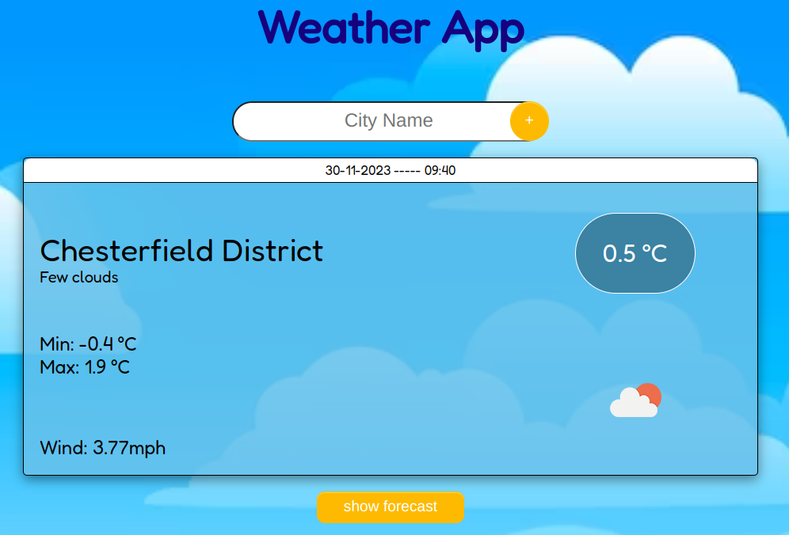
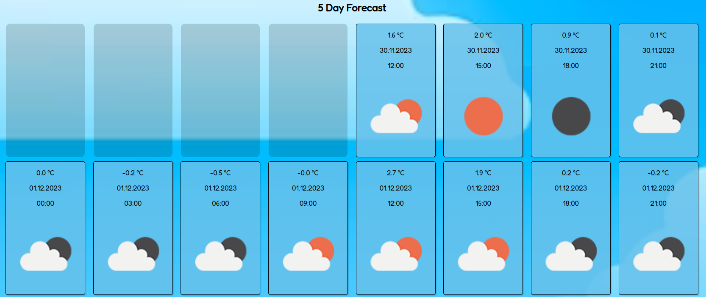

# Weather App

This mini project was started during my time on the Northcoders bootcamp. After I had completed the course, I revisited this to finish off the functionality and also tidy up the syling.
 

This is a basic weather app that fetches live data from the Open Weather API. It can give you the current weather at a location of choice as below:

or give you the forecast for the next 5 days:

